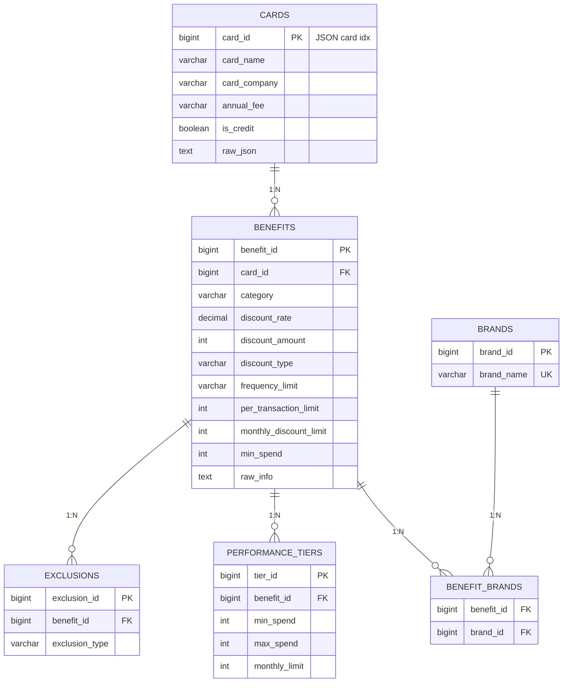
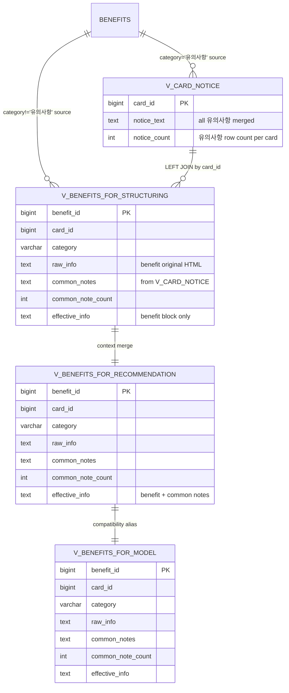

## 고려점 반영 요약
1. 유의사항 2건 이상 카드 대응:
- `v_card_notice`에서 `benefit_id` 순으로 `GROUP_CONCAT ... OVER (PARTITION BY card_id ORDER BY benefit_id)`를 사용해 결합 순서를 고정했습니다.
- 유의사항 개수 확인을 위해 `notice_count`를 함께 노출합니다.
- 다중 유의사항 구분을 위해 결합 구분자 `[[COMMON_NOTE_SPLIT]]`를 사용합니다.

2. 경계 명확화:
- `effective_info`에는 `[혜택 원문 시작]...[혜택 원문 끝]` / `[공통 유의사항 시작]...[공통 유의사항 끝]` 경계 태그를 사용합니다.
- 동시에 `common_notes`를 별도 컬럼으로 노출해, 모델 프롬프트에서 원문과 공통조건을 분리 참조할 수 있게 했습니다.

3. 용도 분리:
- 정형화(benefit 필드 추출): `v_benefits_for_structuring` 사용
- 추천/적용 판단(공통조건 반영): `v_benefits_for_recommendation` 또는 `v_benefits_for_model` 사용
