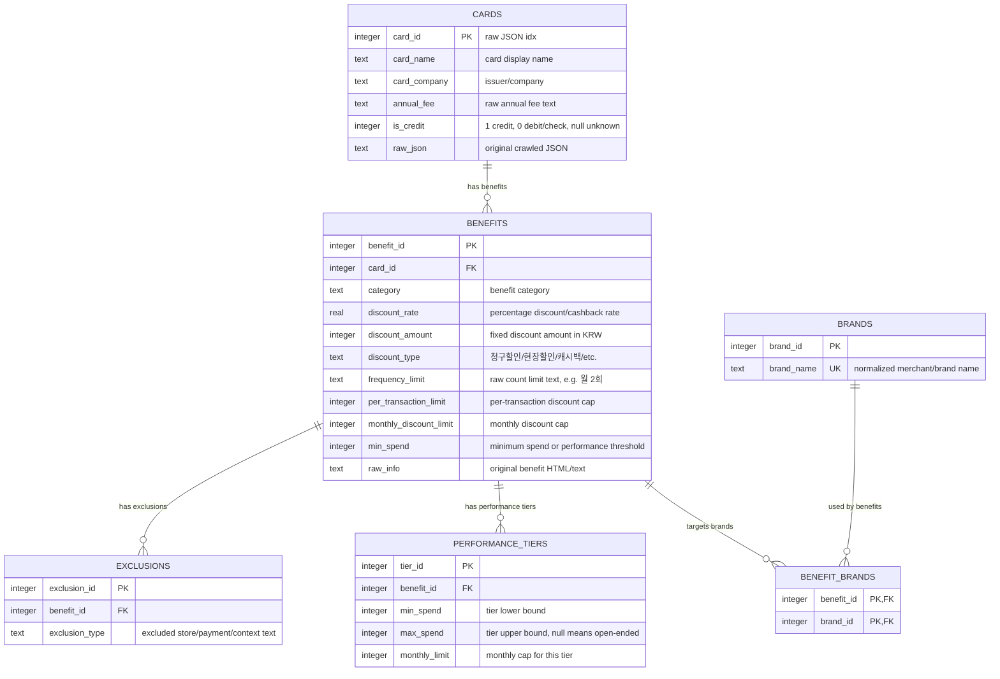

# Logical ERD: Cafe Benefit Database

보고서와 포스터 설명을 위한 논리 ERD입니다.  
카드 추천에 직접 사용되는 핵심 정형 데이터 모델만 표시합니다.

- 핵심 테이블: 6개

## Table Roles

| table | role |
| --- | --- |
| `cards` | 카드 1장 단위의 기본 정보와 크롤링 원본 JSON 저장 |
| `benefits` | 카드 혜택 원문과 핵심 정형 필드 저장 |
| `brands` | 혜택 대상 브랜드/가맹점명 사전 |
| `benefit_brands` | 혜택과 브랜드의 다대다 연결 테이블 |
| `performance_tiers` | 전월 실적 구간별 월 할인 한도 저장 |
| `exclusions` | 백화점 입점 매장, 상품권 구매, 온라인 주문 등 제외 조건 저장 |

## Structured Benefit Fields

`benefits`의 스칼라 필드와 관계형 테이블을 합쳐 아래 조건을 정형화합니다.

| field/table | meaning |
| --- | --- |
| `discount_rate` | 정률 할인/캐시백 비율 |
| `discount_amount` | 정액 할인 금액 |
| `discount_type` | 할인 방식 |
| `frequency_limit` | 일/월/연 제공 횟수 제한 원문 |
| `per_transaction_limit` | 건당 할인 한도 |
| `monthly_discount_limit` | 월 할인 한도 |
| `min_spend` | 최소 결제 금액 또는 단일 전월 실적 조건 |
| `brands` + `benefit_brands` | 혜택 적용 브랜드/가맹점 |
| `performance_tiers` | 다단계 전월 실적 구간과 구간별 월 한도 |
| `exclusions` | 혜택 제외 조건 |

## Current Data Size

| table | rows |
| --- | ---: |
| `cards` | 2,790 |
| `benefits` | 16,619 |
| `brands` | 117 |
| `benefit_brands` | 1,634 |
| `performance_tiers` | 578 |
| `exclusions` | 2,667 |
