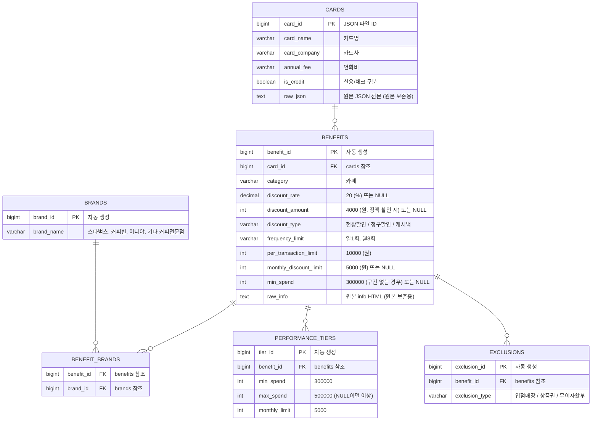

```mermaid
erDiagram
    BRANDS {
        bigint brand_id PK "자동 생성"
        varchar brand_name "스타벅스, 커피빈, 이디야, 기타 커피전문점"
    }

    CARDS {
        bigint card_id PK "JSON 파일 ID"
        varchar card_name "카드명"
        varchar card_company "카드사"
        varchar annual_fee "연회비"
        boolean is_credit "신용/체크 구분"
        text raw_json "원본 JSON 전문 (원본 보존용)"
    }

    BENEFITS {
        bigint benefit_id PK "자동 생성"
        bigint card_id FK "cards 참조"
        varchar category "카페"
        decimal discount_rate "20 (%) 또는 NULL"
        int discount_amount "4000 (원, 정액 할인 시) 또는 NULL"
        varchar discount_type "현장할인 / 청구할인 / 캐시백"
        varchar frequency_limit "일1회, 월8회"
        int per_transaction_limit "10000 (원)"
        int monthly_discount_limit "5000 (원) 또는 NULL"
        int min_spend "300000 (구간 없는 경우) 또는 NULL"
        text raw_info "원본 info HTML (원본 보존용)"
    }

    BENEFIT_BRANDS {
        bigint benefit_id FK "benefits 참조"
        bigint brand_id FK "brands 참조"
    }

    PERFORMANCE_TIERS {
        bigint tier_id PK "자동 생성"
        bigint benefit_id FK "benefits 참조"
        int min_spend "300000"
        int max_spend "500000 (NULL이면 이상)"
        int monthly_limit "5000"
    }

    EXCLUSIONS {
        bigint exclusion_id PK "자동 생성"
        bigint benefit_id FK "benefits 참조"
        varchar exclusion_type "입점매장 / 상품권 / 무이자할부"
    }

    CARDS ||--o{ BENEFITS : ""
    BENEFITS ||--o{ BENEFIT_BRANDS : ""
    BRANDS ||--o{ BENEFIT_BRANDS : ""
    BENEFITS ||--o{ PERFORMANCE_TIERS : ""
    BENEFITS ||--o{ EXCLUSIONS : ""
```