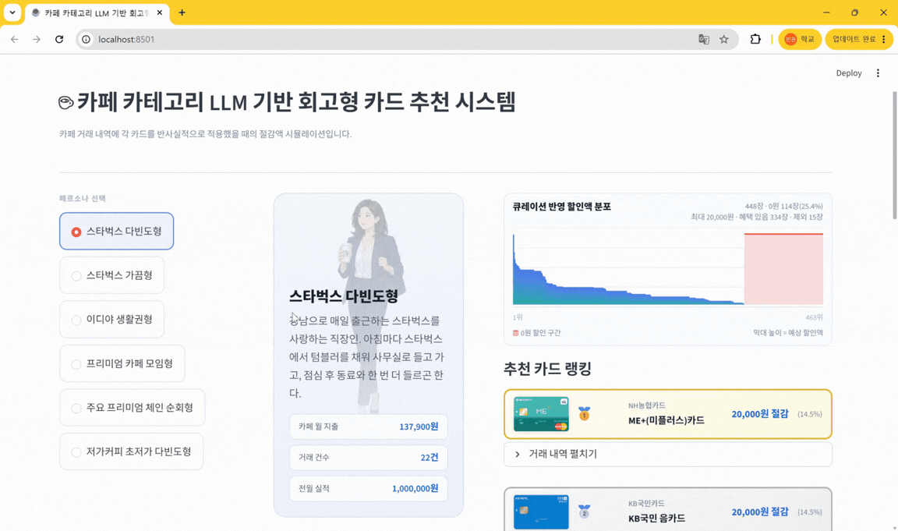
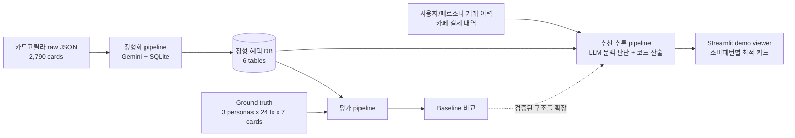

# 비정형 카드 혜택 정형화를 통한 LLM 기반 신용카드 추천 시스템

비정형 카드 혜택을 정형화해서, 사용자의 거래 이력을 바탕으로 LLM이 카드별 절감액을 추론하고 최적 카드를 추천하는 회고형 시스템입니다.



**핵심 결과:** 504건 ground truth 평가에서 정형화 입력은 raw text 단독 baseline 대비 F1 Score를 `0.92 -> 0.97`로 높였고, 혜택 제외 조건 판별 오류를 `7건 -> 0건`으로 줄였습니다.

## Problem

카드 혜택은 카드사마다 다른 형식의 약관 텍스트에 흩어져 있습니다. 예를 들어 "투썸플레이스 10% 할인, 일 1회/월 8회, 건당 1만원 한도, 백화점 입점 매장 제외"처럼 대상 가맹점, 할인율, 횟수 제한, 한도, 제외 요건이 한 문장 안에 누적됩니다. 사용자가 자신에게 유리한 카드를 비교하려면 시스템은 각 거래마다 이 조건들이 실제로 적용되는지 판단해야 합니다.

기존 추천 서비스는 인기 순위나 카테고리 선택 기반 정렬에 가까운 경우가 많고, 정교한 계산형 서비스도 추천 원리가 공개되지 않는 경우가 많습니다. 본 프로젝트는 LLM의 문맥 이해 능력을 사용하되, 그 판단이 실제 추천 정확도를 높이는지 ground truth로 검증하는 것을 목표로 했습니다.

핵심 질문은 다음과 같습니다.

> LLM이 비정형 혜택 원문을 그대로 읽는 것보다, 혜택 조건을 명시적 필드로 분리해 주었을 때 실제 추천 판단이 더 정확해지는가?

## Architecture



시스템의 주 흐름은 정형화된 카드 혜택 DB와 사용자/페르소나 거래 이력이 만나 카드별 예상 절감액을 만들고, 그 결과가 demo viewer로 이어지는 구조입니다. 평가 pipeline은 추천 구조가 raw text baseline보다 신뢰할 수 있는지 검증합니다. 검증된 구조를 463장 카페 카드와 6개 소비 패턴에 확장 적용한 결과물이 `final_viewer/`의 회고형 추천 viewer입니다.

## Research Design

### 1. 데이터 수집과 파일럿 범위

카드고릴라 내부 API에서 카드 2,790장을 수집했습니다. 전체 카드를 한 번에 정형화하기보다, 먼저 구조가 비교적 동질적인 카테고리에서 검증한 뒤 확장하는 방식을 택했습니다. n-gram 분석 결과 카페 카테고리는 할인 중심으로 혜택이 수렴하고, 브랜드/횟수/실적/제외 조건처럼 다른 카테고리에도 재사용 가능한 비교 축을 포함했습니다. 그래서 카페 혜택 보유 카드 463장을 파일럿 범위로 확정했습니다.

### 2. 비정형 텍스트에서 정형 DB로

정형화는 먼저 필드를 정해 끼워 맞추는 방식이 아니라, 전체 혜택 텍스트의 n-gram 빈도 분석으로 반복 조건을 귀납한 뒤 설계했습니다. 그 결과 브랜드 매칭, 횟수 제한, 전월 실적 구간, 제외 요건, 할인율 이원화, 최저 결제 금액, 총액 한도 같은 평가 축이 도출되었습니다.

DB는 카드, 혜택, 브랜드, 혜택-브랜드 연결, 실적 구간, 제외 조건의 6개 테이블로 구성했습니다. 한 혜택 안에서 가맹점별 할인율이 다르거나 전월 실적별 월 한도가 달라지는 경우가 있어, 단일 행에 억지로 넣으면 비교 가능성이 떨어진다고 판단했습니다. 자세한 정규화 근거는 [structurization/README.md](structurization/README.md)에 정리했습니다.

### 3. LLM 추론과 결정론적 산술 분리

추천 단계에서는 LLM과 코드의 책임을 분리했습니다. LLM은 "스타벅스 신세계강남점이 백화점 입점 매장인가"처럼 가맹점명과 약관 조건의 문맥 판단을 맡습니다. 반면 전월 실적, 월 횟수, 월 할인 한도, 건당 한도 같은 누적 산술은 코드가 결정론적으로 처리합니다.

이 설계는 정확도뿐 아니라 오류 분석을 위한 선택입니다. LLM에게 모든 거래를 한꺼번에 맡기면 어느 거래에서 어떤 조건이 틀렸는지 추적하기 어렵습니다. 그래서 평가와 데모 모두 거래 1건 단위로 판단 로그를 남기고, 이후 코드가 카드별 절감액을 누적합니다.

### 4. Ground Truth 기반 평가

평가는 3개 페르소나, 24건 거래, 7개 카드로 구성된 504건 ground truth 위에서 수행했습니다. 7개 feature 축은 정형화 스키마에서 역산했습니다: 브랜드 매칭, 횟수 제한, 전월 실적 구간, 제외 요건, 할인율 이원화, 최저 결제 금액, 할인 총액 한도입니다. 각 거래-페르소나-카드 조합의 정답 절감액은 수동 산출했습니다.

정형화 입력을 사용한 본 시스템은 Accuracy `97.6% (492/504)`, F1 Score `0.97`, MCC `0.95`를 기록했습니다. 같은 LLM과 산술 코드를 유지하고 입력만 raw text로 바꾼 baseline 대비 오류는 `23건 -> 12건`, False Positive는 `14건 -> 6건`으로 줄었습니다. 특히 혜택 제외 대상 판별 오류가 `7건 -> 0건`으로 줄어, 정형화의 주효과가 "잘못 적용되는 혜택을 억제하는 것"임을 확인했습니다.

### 5. 회고형 추천 데모

검증된 구조를 카페 카드 463장과 6개 소비 패턴에 확장 적용해 Streamlit viewer를 만들었습니다. 데모는 사용자의 지난달 카페 거래 이력에 각 카드를 반사실적으로 적용하고, 카드별 예상 절감액과 추천 랭킹을 보여줍니다. 총 계산 규모는 카드 463장 x 페르소나별 거래 조합 기준 38,429건입니다.

6개 페르소나는 단순 예시가 아니라 추천 결과가 갈라지는 축을 자극하도록 설계했습니다. 스타벅스 다빈도형, 이디야 생활권형, 프리미엄 카페 모임형, 저가커피 초저가 다빈도형처럼 브랜드 집중도, 객단가, 전월 실적, 월 이용 횟수가 달라지면 같은 카드 풀에서도 최적 카드가 달라집니다.

## Quick Start

```powershell
git clone https://github.com/cohi42/creditcard_recomm.git
cd creditcard_recomm

# LLM 호출이 필요한 재현 단계 (PowerShell)
$env:GEMINI_API_KEY="your_api_key"
pip install requests
cd card_crawling
python main.py
cd ..
node structurization/load_raw_to_sqlite.js
node structurization/structure_cafe_benefits_with_gemini.js
node structurization/enrich_cafe_benefits_with_notices.js --source-db db/cards.db --output-db db/cafe_v3.db --overwrite-output
node final_viewer/generate_recommendation_outputs.js --db db/cafe_v3.db

# 데모 실행
pip install -r final_viewer/requirements.txt
cd final_viewer
streamlit run app.py
```

`db/*.db`, `card_crawling/data/raw/`, `final_viewer/recommendation_outputs/`, `test_outputs/`는 재생성 가능한 산출물이라 Git에서 제외합니다. clean clone에서는 위 생성 단계를 먼저 실행해야 demo viewer가 전체 데이터를 읽을 수 있습니다.

## Folder Map

| 폴더 | pipeline | 역할 |
| --- | --- | --- |
| `card_crawling/` | 데이터 수집 | 카드고릴라 API에서 원천 카드 JSON을 수집하고 품질을 확인합니다. [README](card_crawling/README.md) |
| `n-gram_analysis/` | 정형화 설계 근거 | 혜택 텍스트의 반복 조건을 분석해 파일럿 카테고리와 정형 필드 후보를 도출합니다. [README](n-gram_analysis/README.md) |
| `structurization/` | 비정형 혜택 -> 정형 DB | Gemini와 SQLite를 사용해 카페 혜택을 6개 테이블 구조로 정형화합니다. [README](structurization/README.md) |
| `db/` | SQLite 실험 DB 위치 | 로컬 실험 DB가 놓이는 위치입니다. DB 파일은 Git에서 제외합니다. [README](db/README.md), [ERD](ERD.md) |
| `evaluation/` | ground truth 평가 / baseline 비교 | 504건 정답지로 정형화 입력과 raw text baseline을 비교합니다. [README](evaluation/README.md) |
| `final_viewer/` | 회고형 추천 계산 / Streamlit demo | 6개 소비 패턴별 카드 절감액 랭킹을 생성하고 viewer로 보여줍니다. [README](final_viewer/README.md) |
| `docs/` | README용 전시 이미지 | 루트 README에서 사용하는 데모 스크린샷을 보관합니다. [README](docs/README.md) |
| `scripts/` | 연구 보조 점검 스크립트 | DB view와 샘플 카드 상태를 빠르게 점검합니다. [README](scripts/README.md) |
